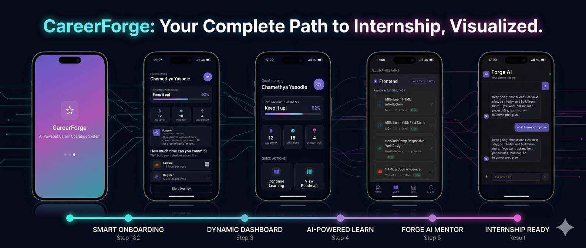

<div align="center">

# CareerForge

### *The AI-Powered Career Operating System for Student Developers*



<br/>

> **CareerForge transforms students into internship-ready developers** through personalised AI guidance, structured skill tracking, curated learning resources, and a 24/7 AI career mentor — all in one cross-platform mobile app.

<br/>

**Built With:** React Native · Expo · TypeScript · Supabase · PostgreSQL · Gemini AI

<br/>

[Features](#-features) • [Tech Stack](#-tech-stack) • [Architecture](#-architecture) • [Database](#-database-design) • [Screens](#-screens) • [Getting Started](#-getting-started)

</div>

---

# The Problem

Most CS students face the same painful cycle:

> *"I've done the tutorials. I've watched the YouTube videos. But I don't know what skills actually matter, what to build, or if I'm actually ready for internships."*

Generic learning platforms teach syntax — not careers. Students are left guessing:

- Which skills do real internships actually require?
- What should I focus on next?
- Am I ready to apply — or am I wasting my time?

# The Solution

**CareerForge** closes the gap between *learning* and *landing your first internship*.

It acts as a **personal career mentor that's always available** — tracking your skills, curating personalised learning resources, giving you AI-powered guidance, and showing you a live readiness score so you always know exactly where you stand.

```text
Smart Onboarding → Skill Tracking → AI-Curated Learning → Forge AI Mentor → Internship Ready
```

---

#  Features

##  Authentication System

A complete, production-grade auth flow built on Supabase Auth.

- Email + OTP verification on sign up
- Secure session management with automatic token refresh
- Smart routing — new users go through onboarding, returning users go straight to dashboard
- Sign out clears the device session only — all data stays in the database forever
- Row Level Security enforces data isolation at the database level, not just application level

---

##  Smart Onboarding

A 4-step personalisation flow that runs once for new users. Every answer drives personalisation across the entire app.

| Step | What we capture | How it personalises the app |
|------|----------------|----------------------------|
| Primary goal | internship / build skills / career switch | Changes readiness score label, weights, and targets |
| Current level | beginner / intermediate / advanced | Sets skill tree starting point, adjusts AI advice |
| Role interests | frontend / backend / mobile / devops / AI | Filters skill tree order, learn resources, AI context |
| Time commitment | casual / regular / intensive | Shapes AI pacing and weekly targets |

---

##  Internship Readiness Score

A dynamic score calculated from real activity — not just time spent.

```text
Score = (Skills Completed × 35%) + (Projects Built × 30%) + (Consistency × 20%) + (Depth × 15%)
```

The label and colour adapt to the user's goal:

- **Internship** → "Internship Readiness" — weights skills and projects highest
- **Build Skills** → "Skill Mastery" — weights depth and consistency
- **Career Switch** → "Career Transition" — weights foundations and projects

---

##  Skill Profile

An interactive skill tree covering every major development domain.

- Domains: Frontend, Backend, Mobile, DevOps, AI/ML
- User's selected role domains appear first with a "Your focus" badge
- Tap any skill to mark it done → saved instantly to Supabase
- Domain progress bars update live as skills are ticked
- Overall percentage recalculates in real time
- Skills feed directly into the readiness score and AI context

---

##  Learn Screen

Shows exactly what to learn next based on the user's real skill progress.

- "Continue where you left off" card — first unticked skill in the user's selected domain
- Full learning roadmap per domain — done ✅ / current 🔵 / not started
- AI-generated resources per skill via Gemini API — YouTube tutorials, official docs, freeCodeCamp, practice sites
- Resources generated once per skill, cached permanently in Supabase — no repeated API calls
- All resources are free — links open in browser or YouTube app with one tap
- Resources personalised to the user's level (beginner gets different links than intermediate)

---

##  Forge AI — Career Mentor Chat

A 24/7 AI career mentor powered by Gemini AI, running securely via Supabase Edge Functions.

- Personalised welcome message using the user's real name, goal, level, and skill count
- Free text input — user types anything in their own words, no restrictions
- System prompt built from the user's Supabase profile before every conversation — AI already knows who they are
- Quick prompt chips on first open:
  - "What should I learn next?"
  - "What projects should I build?"
  - "How ready am I?"
  - "Review my skill gaps"
- Chips disappear after first message — conversation flows naturally from there
- Typing indicator while Gemini generates the response
- Full chat history persisted in Supabase — conversation continues where the user left off
- Gemini API called server-side via Supabase Edge Functions — API key never exposed to the client
- Uses **gemini-2.5-flash** with the **Google Generative Language API v1beta**

---

##  Dashboard

The personalised home screen that brings everything together.

- Time-aware greeting using the user's name from Supabase Auth
- Internship readiness score with animated progress bar — label and colour adapt by goal
- Live stats row — streak days, skills completed, projects built
- Quick action tiles — Continue Learning, View Roadmap, Chat with AI, Projects
- Forge AI daily insight card with personalised tip
- Bottom navigation bar persisting across all screens

---

#  Tech Stack

| Layer | Technology | Purpose |
|-------|-----------|---------|
| Mobile | React Native + Expo | Cross-platform iOS & Android from one codebase |
| Language | TypeScript | Full type safety across all screens and services |
| Navigation | Expo Router | File-based routing with tab and stack navigation |
| Backend | Supabase | Auth, PostgreSQL database, real-time, edge functions |
| Database | PostgreSQL via Supabase | Relational data with Row Level Security on every table |
| Authentication | Supabase Auth | Email + OTP, JWT session management |
| AI Engine | Google Gemini API (`gemini-2.5-flash`) | Chat responses, skill resource generation |
| AI Gateway | Supabase Edge Functions | Server-side Gemini calls — key never touches the client |
| Icons | Expo Vector Icons (Ionicons) | UI icons throughout |

---

#  Architecture

```text
┌────────────────────────────────────────────────────────────────┐
│                    CareerForge Mobile App                     │
│               React Native · Expo · TypeScript                │
├─────────────┬──────────────────┬──────────────┬───────────────┤
│  Auth &     │   Dashboard &    │  Skills &    │  Forge AI     │
│  Onboarding │   Readiness      │  Learn       │  Chat         │
│  Routing    │   Score          │  Resources   │  Mentor       │
└──────┬──────┴────────┬─────────┴──────┬───────┴──────┬────────┘
       │               │                │              │
       ▼               ▼                ▼              ▼
┌────────────────────────────────────────────────────────────────┐
│                        Supabase                                │
│          Auth · PostgreSQL · RLS · Edge Functions             │
│                                                                │
│  user_profiles · skill_progress · chat_messages               │
│  skill_resources · daily_activity                             │
└──────────────────────────────────────┬─────────────────────────┘
                                       │
                                       ▼
                         ┌───────────────────────────┐
                         │   Supabase Edge Functions │
                         │   dynamic-task            │
                         │   get-skill-materials     │
                         └─────────────┬─────────────┘
                                       │
                                       ▼
                         ┌───────────────────────────┐
                         │    Google Gemini API      │
                         │    gemini-2.5-flash       │
                         │  Career chat + Resources  │
                         └───────────────────────────┘
```

---

#  Database Design

CareerForge uses Supabase (PostgreSQL) with Row Level Security on every table.

Users can only ever read and write their own data — enforced at the database level.

```sql
-- Core profile — saved once at onboarding
user_profiles (
  id              uuid references auth.users PRIMARY KEY,
  goal            text,
  level           text,
  roles           text[],
  time_commitment text,
  onboarding_completed boolean default false,
  created_at      timestamptz default now()
)

-- Skill activity — one row per ticked skill
skill_progress (
  id           uuid PRIMARY KEY,
  user_id      uuid references auth.users,
  skill_id     text,
  status       text,
  completed_at timestamptz,
  unique(user_id, skill_id)
)

-- AI Chat history — one row per message
chat_messages (
  id         uuid PRIMARY KEY,
  user_id    uuid references auth.users,
  role       text,
  content    text,
  created_at timestamptz
)

-- Skill resources cache — generated once by Gemini, reused forever
skill_resources (
  id             uuid PRIMARY KEY,
  skill_id       text not null,
  title          text not null,
  resource_type  text,
  url            text not null unique,
  provider       text,
  created_at     timestamptz
)

-- Streak tracking — one row per day app is opened
daily_activity (
  id      uuid PRIMARY KEY,
  user_id uuid references auth.users,
  date    date,
  unique(user_id, date)
)
```

All tables have Row Level Security enabled with policies scoped to `auth.uid()`.

---

#  Screens

| Screen | What it does | Uses AI |
|--------|-------------|---------|
| Sign Up | Email + OTP verification via Supabase Auth | No |
| Sign In | Password login, routes to onboarding or dashboard | No |
| Onboarding | 4-step goal, level, roles, time flow — saves to Supabase | No |
| Dashboard | Readiness score, stats, quick actions, AI insight tip | Cached tip |
| Skill Profile | Tap to tick/untick skills — saves to Supabase in real time | No |
| Learn | Next skill card + roadmap + curated resources per skill | Gemini (cached) |
| AI Chat | Full conversational Forge AI career mentor | Gemini (live) |

---

#  Getting Started

## Prerequisites

- Node.js `>=18.x`
- Expo CLI

```bash
npm install -g expo-cli
```

- Supabase account:
  https://supabase.com

- Google AI Studio:
  https://aistudio.google.com

---

## Installation

```bash
git clone https://github.com/chamethyaY/careerforge.git

cd careerforge

npm install

cp .env.example .env
```

---

## Environment Variables

```env
EXPO_PUBLIC_SUPABASE_URL=your_supabase_project_url
EXPO_PUBLIC_SUPABASE_ANON_KEY=your_supabase_anon_key
EXPO_PUBLIC_GEMINI_API_KEY=your_gemini_api_key
```

---

## Supabase Setup

Run this inside the Supabase SQL Editor:

```sql
create table user_profiles (
  id uuid references auth.users primary key,
  goal text,
  level text,
  roles text[],
  time_commitment text,
  onboarding_completed boolean default false,
  created_at timestamptz default now()
);

create table skill_progress (
  id uuid default gen_random_uuid() primary key,
  user_id uuid references auth.users,
  skill_id text,
  status text default 'done',
  completed_at timestamptz default now(),
  unique(user_id, skill_id)
);

create table chat_messages (
  id uuid default gen_random_uuid() primary key,
  user_id uuid references auth.users,
  role text,
  content text,
  created_at timestamptz default now()
);

create table skill_resources (
  id uuid default gen_random_uuid() primary key,
  skill_id text not null,
  title text not null,
  resource_type text,
  url text not null unique,
  provider text,
  created_at timestamptz default now()
);

alter table user_profiles enable row level security;
alter table skill_progress enable row level security;
alter table chat_messages enable row level security;
alter table skill_resources enable row level security;

create policy "own profile"
on user_profiles
for all
using (auth.uid() = id)
with check (auth.uid() = id);

create policy "own skills"
on skill_progress
for all
using (auth.uid() = user_id)
with check (auth.uid() = user_id);

create policy "own messages"
on chat_messages
for all
using (auth.uid() = user_id)
with check (auth.uid() = user_id);

create policy "read resources"
on skill_resources
for select
using (auth.role() = 'authenticated');
```

---

## Supabase Edge Functions

The Gemini API is called server-side to keep the API key secure.

Add your key to Supabase secrets:

```text
Supabase Dashboard → Edge Functions → Secrets → Add GEMINI_API_KEY
```

---

## Gemini API Configuration

CareerForge uses:

- `gemini-2.5-flash`
- Google Generative Language API (`v1beta`)

Example endpoint:

```text
https://generativelanguage.googleapis.com/v1beta/models/gemini-2.5-flash:generateContent
```

---

## Run the App

```bash
npx expo start
```

---

#  Project Structure

```text
careerforge/
├── app/
│   ├── index.tsx
│   ├── login.tsx
│   ├── onboarding.tsx
│   └── (tabs)/
│       ├── index.tsx
│       ├── learn.tsx
│       ├── skills.tsx
│       └── ai-chat.tsx
├── src/
│   ├── lib/
│   │   ├── supabase.ts
│   │   ├── geminiChat.ts
│   │   └── skillResources.ts
│   └── constants/
│       └── skills.ts
├── supabase/
│   └── functions/
│       ├── dynamic-task/
│       └── get-skill-materials/
└── .env
```

---

#  Security

- Row Level Security on every Supabase table
- JWT tokens managed by Supabase Auth with automatic refresh
- Gemini API key stored in Supabase Edge Function secrets
- Environment variables for all client-side config
- OTP email verification on sign up

---

#  Author

**Chamethya Yasodie**  
Full-Stack Developer · BSc Computer Science · University of Westminster (IIT Colombo)

- GitHub: https://github.com/chamethyaY
- LinkedIn: https://www.linkedin.com/in/chamethya-yasodie-a8278a349/
- Email: k.chamethya@gmail.com

---

#  License

MIT License — see [LICENSE](LICENSE) for details.

---

<div align="center">
  <sub>Built with ❤️ by Chamethya Yasodie</sub>
</div>
